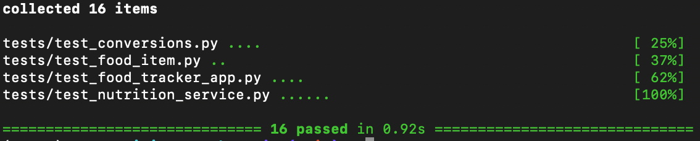

# Nutrition Tracker

Helps track daily food intake and nutrition information.

---

## What it does

This program lets users:

- Add foods they eat as well as the serving size
- Get nutrition information (calories, protein, carbs, fat, fiber)
- View total nutrition for the day
- View a macronutrients pie chart that visualizes their percentage amounts

---

## How it works

The project is made up of the following main parts:

- **FoodItem** → stores information about one food (like calories and protein)
- **Nutrition Service** → gets and/or calculates nutrition data
- **GUI** → a Tkinter-based app (FoodTrackerApp) that lets the user search for foods, enter amount and unit, add foods to a log, view a list of foods entered, see running totals for nutrition, and view a pie chart showing macronutrient breakdown

---

## How to install

1. Make sure you have Python installed (3.8+ preferred)

2. Clone or download the project

3. Create and activate a virtual environment:

```bash
python -m venv .venv
source .venv/bin/activate   # Mac/Linux
.venv\Scripts\activate      # Windows
```

4. Install required packages:

```bash
pip install -r requirements.txt
```

---

## USDA API Setup

This project uses the **USDA FoodData Central API** to retrieve nutrition data for foods.

To use real nutrition data:

- Go to the USDA API website:
  [https://fdc.nal.usda.gov/api-key-signup](https://fdc.nal.usda.gov/api-key-signup)
- Create a free account and request an API key
- Create a file named `.env` in the root directory of the project
- Add your API key like this:

```
API_KEY=your_usda_api_key_here
```

---

## Run the program

```bash
python main.py
```

---

## Test Results
collected 16 items                                                             

tests/test_conversions.py ....                                           [ 25%]
tests/test_food_item.py ..                                               [ 37%]
tests/test_food_tracker_app.py ....                                      [ 62%]
tests/test_nutrition_service.py ......                                   [100%]

============================== 16 passed in 0.92s ==============================
